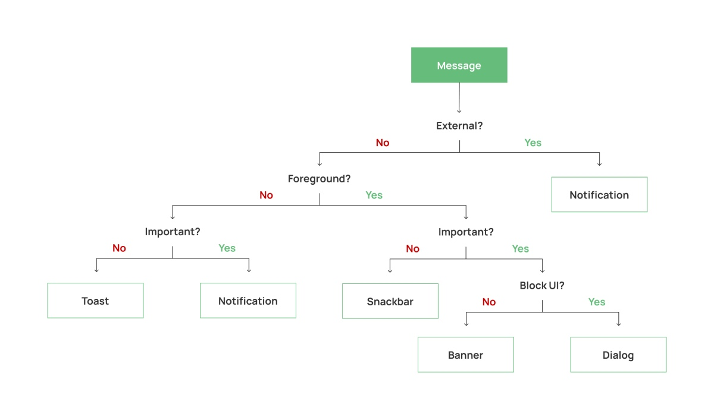
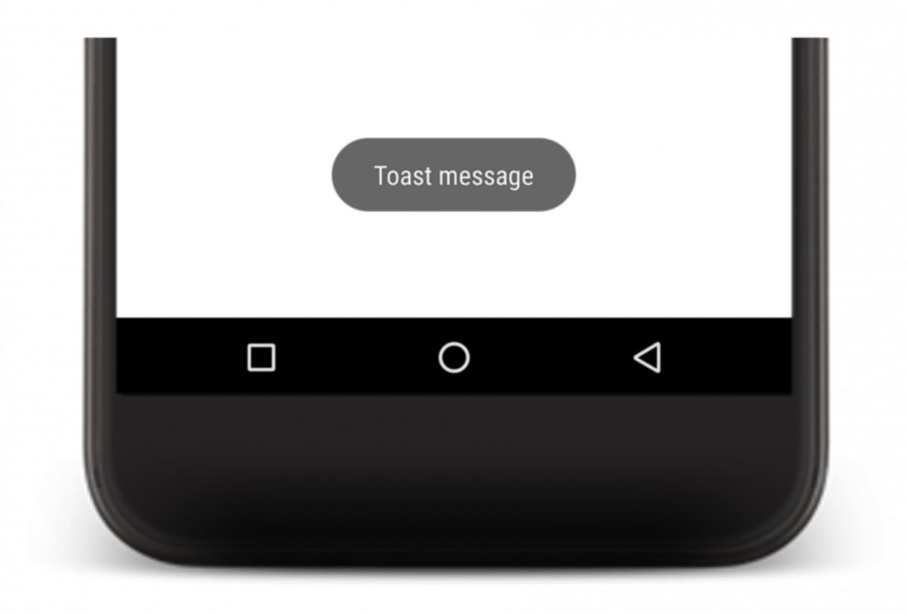
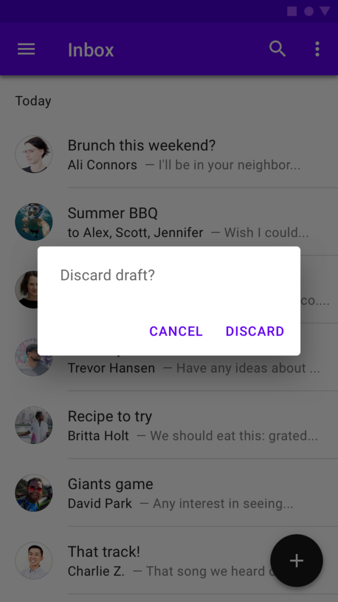
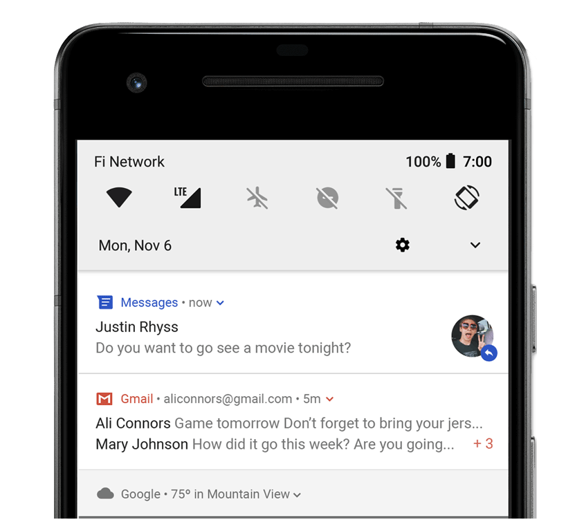

# Show a message
> Originally postet on vladsonkin.com (Choose Wisely: 5 Ways To Show A Message In Android) ➡️ [Wayback Machine](https://web.archive.org/web/20210121033542/https://vladsonkin.com/choose-wisely-5-ways-to-show-a-message-in-android/)

Apps are all about interaction with the user, and messages play a vital part in this. Messages can be different, and we have lots of them: Internet connection is lost, the user deletes an email or cancels the order, uploading a photo requires a sign-in, alarm confirmation, and the list can go on infinitely. We have 5 ways how to show a message in Android, but the question is, which tool to use in which case?

By Android messages, I mean any message that we want to show to the user in our app. Clearly, we have lots of examples, and before we move forward, we need to categorize them somehow.

### External and Internal messages
The first thing we can do is to separate messages by the source. Internal messages come from our app, for example, connection error while performing some API call. External messages are sent from the server, for example, a reminder to learn English.

### Foreground and Background messages
Well, there is no background message; we always show them in the UI thread. By background, I mean we can send that message while our app is in the background, for example, from the **WorkManager**. And the foreground indicates that the message is triggered when our app is visible.

### Message Priority
We can also think of the priority of the message. High priority messages should be permanent and visible in the UI, while low-priority messages can be small and automatically dismissed.

Some messages are so important that they even can block the user flow in your app. For example, the user can cancel the order, and you want to show a blocking message “Are you sure you want to cancel the order?”. The user can’t continue the flow until he confirms or cancels this message.

Now for the exciting part, let’s combine these message parameters with available Android tools.

#### **diagram**


When you want to show some message, ask yourself a couple of questions, and you’ll know the best-suited tool for this! Let’s look at them closer.

## Toast
Android Toast is one of the oldest ways to show some message in your UI. It’s just a quick little message that you show to the user.



The toast message shows on top of the UI and is not tied to any view. Because of this, we can show the Toast message even when the application is in the background. The API is also simple, and you can launch the Toast in one line:

```java
Toast.makeText(applicationContext, "Hello", Toast.LENGTH_LONG).show()
```

The message is automatically dismissed and don’t interrupt the user from the app. You can even have a custom view, but only for foreground Toasts since Android 11.

Use this component for low-priority messages that you need to show when your app is in the background or when there is a possibility that the app could be closed. A good example is the Alarm app. The user almost always closes the app after setting the alarm, and the toast “Alarm is set” remains visible for some time.

Don’t use this for low-priority messages that you want to show while the app is in the foreground. The recommended component for this is **Snackbar**.

## Snackbar
Snackbar is the component that displays some message in the bottom part of your application.


Snackbar is always tied to some view; therefore, it can be shown only when the application is in the foreground. You can also launch a Snackbar with an easy command:

```java
Snackbar.make(contextView, "Hello", Snackbar.LENGTH_LONG).show()
````

It’s similar to the Toast, with the only difference is that you pass a view instead of the context. This view should be contained in the screen view hierarchy where you want to show the Snackbar, and usually, it’s the view of the element that triggered the Snackbar. For example, if you pressed a button to perform an operation and some error occurs, you can use this button view as a contextView for the Snackbar.

The Snackbar is flexible, and you can create any custom view. More than that, it also supports an action button. It’s convenient sometimes; for example, if you have a mail app and a user delete some mail, you can show the Snackbar message “Mail deleted” with an “Undo” action button:

```java
Snackbar.make(contextView, "Mail deleted", Snackbar.LENGTH_LONG)
  .setAction(R.string.action_undo) {
    // Handle the Undo button
  }
  .show()
```

Use this component for any low-priority messages in your app. Do you think your message is important than others and want to give it a bit more visibility? Then you can use the **Banner**.

## Banner
Think of a Banner as an improved Snackbar. The [Banner](https://material.io/components/banners) is a view that lives on top of your UI just below the toolbar and shows a message that should be very visible for the user.


The element requires a user action to be dismissed and contains 1 or 2 action buttons inside. This improves our message chances to be more visible for the users. However, the Banner is a part of the UI and not blocking the application usage so that the user can ignore it.

The bad news is that there is [no official support](https://github.com/material-components/material-components-android/issues/74) for this element, and you need to use some [third-party libraries](https://github.com/cesarferreira/MaterialComponent.Banner) or to [implement it](https://medium.com/@arekk/implementing-material-banners-using-motionlayout-c73e1432f5c6) on your own with a motion layout. 

As a summary, use this element for messages that need more visibility than a Snackbar or when you need multiple action buttons. And when you need more space for the message, just use some custom UI state.

## Dialog
In some cases, messages can be so important that we want to block the whole user flow until the user does some action. And it’s exactly what Dialogs do:


It’s a modal window that appears on top of your UI, and it requires the user to take some action. The dialog usually consists of a title, message, and 2 action buttons:

```java
AlertDialog.Builder(this)
  .setTitle("Title")
  .setMessage("Message")
  .setPositiveButton("Yes") { dialog, button ->

  }
  .setNegativeButton("No") { dialog, button ->

  }
  .show()
```

Use it carefully and only for critical information that requires some action.

## Notifications
Last but not least are Android notifications. In a couple of words, a notification is a message outside your application UI.



Usually, we create notifications for the important events that happen while our app is in the background or when some external events occur. For example, you always receive a notification when you have some new mail.

Notifications are an extensive topic, and here I’ll only say that you can create a notification manually (for example, [from WorkManager](https://medium.com/@ifr0z/workmanager-notification-date-and-time-pickers-aad1d938b0a3)) or by firing a notification externally from [Firebase](https://firebase.google.com/docs/cloud-messaging).

## There is another way to show a message in Android
To be honest, there is another way to know which component to use for a message. Ask your designer. It’s the simplest way, but I still think that the developer should know the app’s available components and how to use them correctly.

When you need to show a message in Android – open [the diagram](#diagram) in this article and answer simple questions. 